# 2024 Advanced Computer Architecture: Practice 1
+ 2023-22271 박찬우

## System Configuration

주어진 Container를 활용하였으며 Container에서 확인된 System / Software Configuration은 아래와 같다.
|Content|Value|
|----|----|
|GPU|	NVIDIA GeForce RTX 3090 * 2|
|CPU|	Intel(R) Xeon(R) Gold 6248R CPU @ 3.00GHz         |
|CPU DRAM| **Unknown**|
|OS|	Ubuntu 22.04|
|Kernel Version	|Linux 5.4.0-182-generic|
|CUDA Version	|12.2|
|NVIDIA Driver Version	|535.171.04|
|Python|	3.11|
|PyTorch|	2.3.1+cu121|


## Question 1
> Examine `distributed_forward()` and `parallel_forward()` and explain how they operate

두 경우는 각 프로세스가 몇 개의 GPU를 관리하는가만 다르며, Data Movement는 다르지 않다. `distributed_forward()`는 여러 개의 Process가 Multinode 또는 Singlenode 환경에서 여러 GPU를 활용하는 경우 호출된다.
각 Process는 한 개의 GPU를 관리한다. `parallel_forward()`는 Singlenode에서 하나의 Process가 여러 GPU를 활용하는 경우 호출된다.

Input은 Dense Feature과 Sparse Feature로 분류되어 처리된다. Dense Feature는 Bottom MLP Layer들을 거쳐서 Size 16의 Vector가 된다. Sparse Feature는 각 Feature에 대한 Embedding Layer를 거치고, Embedded vector와 Dense Featur Vector를 pooling한 결과물을 위 Size 16 vector에 concatenation한다. Size 19 Vector는 Top MLP를 거쳐서 최종 Candidate Prediction에 활용된다.

Dense Feature를 Bottom MLP로 처리하는 과정은 Data Parallel 하다. 모든 GPU는 Bottom MLP Parameter를 가지고, 각 프로세스는 각 프로세스가 맡는 Batch에 대한 Bottom MLP 계산을 수행한다.
```python
# DLRM_Net.distributed_forward
## each process obtain entire dense input, but processes only a portion of it
dense_x = dense_x[ext_dist.get_my_slice(batch_size)]
with record_function("DLRM bottom nlp forward"):
    x = self.apply_mlp(dense_x, self.bot_l)

# DLRM_Net.distributed_forward
## The main process obtain entire dense input and scatters it to each GPU
dense_x = scatter(dense_x, device_ids, dim=0)
x = parallel_apply(self.bot_l_replicas, dense_x, None, device_ids)
```

Sparse Feature의 Embedding 계산은 Model Parallel하다. 각 GPU는 각 Sparse Feature에 대한 Embedding Table을 지닌다.
```python
# DLRM_Net.create_emb
## distributed case: Each process(Each GPU) initializes its own embedding table
## Each process does not initialize embedding table if it is not in charge of handling a sparse feature
def create_emb(self, m, ln, weighted_pooling=None):
    # omitted
    for i in range(0, ln.size):
        if ext_dist.my_size > 1: # distributed case
            if i not in self.local_emb_indices:
                # do not initialize if it is not in charge of handling a sparse feature
                continue
        n = ln[i] # initialization process continue
        # omitted

# DLRM_Net.parallel_forward
## Parallel forward case: distribute each embedding table to each gpu
if self.parallel_model_is_not_prepared:
    for k, emb in enumerate(self.emb_l):
        d = torch.device("cuda:" + str(k % ndevices)) # distributes each embedding table to devices
        # omitted
```

한 Batch의 Sparse Feature 입력은 각 Example들의 26가지 Sparse Feature로 구성된다.
각 GPU는 모든 Example의 특정 Sparse Feature에 대한 Embedding을 Lookup한다.
```python
# DLRM_Net.distributed_forward
## Each worker(GPU) only process input sparse features that it is in charge of.
lS_o = lS_o[self.local_emb_slice]
lS_i = lS_i[self.local_emb_slice]
with record_function("DLRM embedding forward"):
    ly = self.apply_emb(lS_o, lS_i, self.emb_l, self.v_W_l)

# DLRM_Net.parallel_forward
## Distributes each sparse features to each GPU, and performs embedding lookup
t_list = []
i_list = []
for k, _ in enumerate(self.emb_l):
    d = torch.device("cuda:" + str(k % ndevices))
    t_list.append(lS_o[k].to(d))
    i_list.append(lS_i[k].to(d))
lS_o = t_list
lS_i = i_list
ly = self.apply_emb(lS_o, lS_i, self.emb_l, self.v_W_l)
```

모든 GPU들은 각 GPU가 처리한 Sparse Feature Embedding을 교환한다.
각 GPU는 교환 전에는 Batch 전부에 대한 일부 Feature Embedding을 가지고, 교환 후에는 Batch 일부에 대한 모든 Feature Embedding을 가진다.
```python
# DLRM_Net.distributed_forward
a2a_req = ext_dist.alltoall(ly, self.n_emb_per_rank)
ly = a2a_req.wait()

# DLRM_Net.parallel_forward
t_list = []
for k, _ in enumerate(self.emb_l):
    d = torch.device("cuda:" + str(k % ndevices))
    y = scatter(ly[k], device_ids, dim=0)
    t_list.append(y)
```

이로서 각 GPU는 Batch의 일부에 대한 Sparse Feature와 Dense Feature를 가진다. 
`z = self.interact_features(x, ly)`코드는 Pooling, Concatenation을 수행한다.
Top MLP의 모든 파라미터는 각 GPU에 위치하며, Data Parallel하게 동작한다.

(참고) `DLRM_Net.distributed_forward`에서 Bottom MLP Computation과 All-to-All Communication을 Overlap하는 최적화가 적용되어 있다.
```python
a2a_req = ext_dist.alltoall(ly, self.n_emb_per_rank)
# DLRM_Net.distributed_forward
with record_function("DLRM bottom nlp forward"):
    x = self.apply_mlp(dense_x, self.bot_l)
ly = a2a_req.wait()
```

## Question 2
> Inspect the code for `EmbeddingPerfEstimator` & `EmbeddingStorageEstimator` \
> Explain the equations to estimate sharded performance and I/O size when sharding type is Column-wise and Data parallel

Performance는 5가지(Forward Compute, Forward Communication, Backward Compute, Backward Communication, Prefetch) time으로 구성되고, StorageEstimation은 2가지(CPU DRAM, GPU HBM)을 구한다.
Performance Estimation 중 Input과 Output에 가중치가 부여되지 않았고, Pooling에 모든 input이 사용된다고 가정하자. Optimizer는 Adam을 사용했다고 가정한다.

### EmbeddingPerfEstimator

주어진 Sharding Option에 대한 소요 시간을 5가지로 나누어 예측한다. 먼저, 각 Shard의 Forward / Backward Pass에 소요되는 Computation / Communication Time을 예측한다. 추가로, Caching이 활용되는 경우 Prefetch에 소요되는 시간도 예측한다. Performance의 단위는 초 이다.
Computation과 Communication이 Overlap되지 않는다고 가정하여, 그 소요 시간을 모두 더한다.

### EmbeddingStorageEstimator

주어진 Sharding Option에 대해 각 Shard가 소요하는 Storage를 HBM, DRAM으로 나누어 예측한다. `calculate_shard_storages` 함수는 Storage 소요를 4가지(`input`, `output`, `hbm_specific`, `ddr_specific`)으로 나누어 계산한다.
`input`, `output`은 각 shard의 io activation이 차지하는 크기를 의미하며, `hbm_specific`, `ddr_specific`은 훈련 과정에서 발생하는 Parameter, Optimizer State를 저장한다.


Data Parallel이 간결하므로, DataParallel 분석부터 시작하자.

### Data Parallel Computation
- Forward Compute
    - Embedding Operation은 메모리 접근이 주가 되므로 분모에는 HBM Access Bandwidth가 들어간다 (`device_bw`)
        - $bandwidth (bytes/s)$
    - 분자는 메모리 접근 총량이다. $size_X$는 각 데이터 원소 1개의 데이터 크기(byte)이다.
        - Input Features(read, bytes): $I=\sum_{i}b_i |x_i|\times  size_I$, $b_i$는 feature $i$에 대한 batch 개수, $x_i$는 feature $i$에 대한 input 개수
        - Output Embedding(write, bytes): $O=\sum_{i}b_i d\times  size_O$, $d$는 embedding dimension
        - Embedding Table Lookup(read, bytes): $E=\sum_{i}b_i|x_i|d\times  size_E$
        - Performance(s): $\dfrac{I+O+E}{bandwidth}$, 
- Forward Communication
    - Data Paralle은 Forward에서 GPU간 Communication이 없으므로 0이다.
- Backward Compute
    - BWD Compute는 FWD Compute 시간에 상수 2를 곱하여 산출한다.
- Backward Communication
    - Backward 과정에서는 Gradient의 Allreduce와 Optimizer의 Weight Update가 필요하다. 
    - Allreduce: 노드 내 GPU들 간 allreduce를 한 후, 노드 간 allreduce를 수행한다.
        - 각 GPU당 1개의 NIC이 있다고 가정한다.
        - $A =\dfrac{T \times (2N-1)}{N \times BW_{NIC} \times lws}(s)$
        - $lws$: 각 노드당 GPU 수, $BW$: NIC의 Bandwidth, $N$: 노드 수, $T = b \times d$, b는 각 GPU가 처리하는 batch shard 크기
    - Optimizer: Embedding Table의 Weight를 업데이트 하는 데 소요되는 시간이다. C는 상수이다.
        - $O= \dfrac{T \times C_{optimizer}}{BW_{device}}$
    - 총합은 $O+A$이다.
- Prefetch
    - Prefetch할 데이터가 없으므로 0이다.

### Data Parallel Storage
- Input Size: $I=\sum_{i} |x_i| b_i size_I$
- Output Size: $O=\sum_{i} d b_i size_O$
- HBM Specific size: 각 GPU별로 전체 Parameter 및 이에 대한 Optimizer state를 저장해야 한다.
    - Adam Optimizer의 경우 Optimizer Multiplier가 2이다.
    - HBM Specific: $O = P + 2P, P= ve$

### Column-wise Computation
- Forward Compute
    - Input Features(read, bytes): $I=\sum_{i}b_i |x_i|\times W \times  size_I$, $W$는 World Size, $b_i$는 feature $i$에 대한 batch 개수, $x_i$는 feature $i$에 대한 input 개수
    - Output Embedding(write, bytes): $O=\sum_{i}b_i d_s\times W \times  size_O$, $d_s$는 shard의 embedding dimension
    - Embedding Table Lookup(read, bytes): $E=\sum_{i}b_i|x_i| \times \max(d_s, 32)\times W \times  size_E$
    - $penalty$는 shard의 embedding dimension에 따른 메모리 접근 효율 관련한 상수이다.
    - FWD Compute $T=\dfrac{(I+O+E) * penalty}{BW_{device}}$

- Forward Communication
    - $O / BW$ 이며, $BW$는 internode bandwidth 또는 intranode bandwidth이다.
- Backward Compute
    - Forward Copmute의 2배이다.
- Backward Communication
    - $O / BW$ 이며, $BW$는 internode bandwidth 또는 intranode bandwidth이다.
- Prefetch는 없다고 가정한다.

### Column-wise Storage
- Input Size: $I=\sum_{i} |x_i| b_i size_I \times W$, $W$: world size(전체 GPU 개수)
- Output Size: $O=\sum_{i} d_i b_i size_O \times W$, $d_i$: 해당 Shard의 Embedding Dimension
- HBM Specific size: Adam Optimizer의 경우 Optimizer Multiplier가 2이다.
    - Optimizer Sizes: $O = P + 2P, P= vd_s$, $d_s$는 shard의 embedding dimension

## Question 3
> Inspect the code GridSearchProposer, GreedyProposer, UniformProposer \
> Explain how each Proposer proposed proposals in detail

Proposer는 Sharding Option을 제안하여 Embedding Sharding Plan을 짤 수 있도록 제안한다.
- UniformProposer은 모든 Embedding에 같은 종류의 Sharding Option을 맞춘 조합을 제공한다. 
    - `sharding_options_by_type_and_fqn` table을 통해 sharding option을 타입별로 관리하고, 제공하는 ShardingPlan은 같은 sharding type으로 구성된 sharding option list를 제공한다.
- GridSearchProposer는 각 Embedding에 적용 가능한 모든 Sharding Option들의 조합을 제공한다. 
    - 각 embedding은 서로 다른 종류의 Embedding Shard Type을 가질 수 있다.
    - 각 Embedding별로 Performance가 가장 좋은(시간이 가장 짧은) Sharding Option 순서로 정렬되어 있으며, Grid Search를 수행한다.
- GreedyProposer는 각 Iteration마다, 가장 Storage 사용량이 많은 Embedding의 ShardingOption을 바꿔 본다.
    - Proposer에 주어지는 Search Space는 Embedding Table 별로 관리되며, 각 Embedding Table에 대해 성능이 가장 좋은 순서대로 정렬된다.
    - `feedback`이 주어지는 경우 storage 사용량이 가장 큰 fqn(embedding table)을 찾는다.
    - 해당 FQN에 대해서 차선으로 Performance가 좋은 ShardingOption으로 바꾸고, ShardingOption들을 제공한다.

## Question 4
> Profile torchrec_dlrm. Visualize the profile result. Find out some helpful information based on your profiled result. (Speficy your environment setting and batch size first)

Dataset은 Kaggle Display Advertising Challenge Dataset을 사용하였다.
System Configuration은 보고서 초에 기재하였다. train, validation, test batchsize는 64로 하였다. 
Profiling은 Train 총 256 step, Validation 256 Step, Test 256 Step 진행하였다.
Embedding Table 26개는 Table Wise로 분산되었다.

nsys 프로파일러 실행 결과 이미지는 아래와 같다.
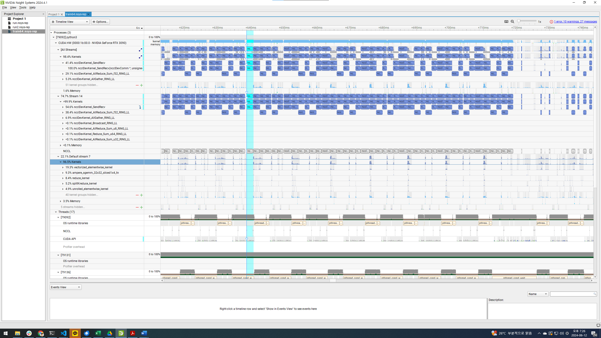

총 커널 실행 시간 중 73.3%는 nccl SendRecv Kernel이 차지하여 가장 큰 비중을 차지했으며, 그 다음은 AllReduce_Sum 커널(16.3%)이다. 즉, 해당 application의 훈련 과정에서는 Communication이 큰 시간을 차지하며, Compute Unit의 활용도가 낮을 수 있다.

|Kernel|Count|Duration(mean)|Duration(median)|
|----|----|----|----|
|ncclDevKernel_SendRecv|6670|694.377us|53.504us|
|ncclDevKernel_AllReduce_Sum_f32_RING_LL|1020|1.011ms|405.745us|

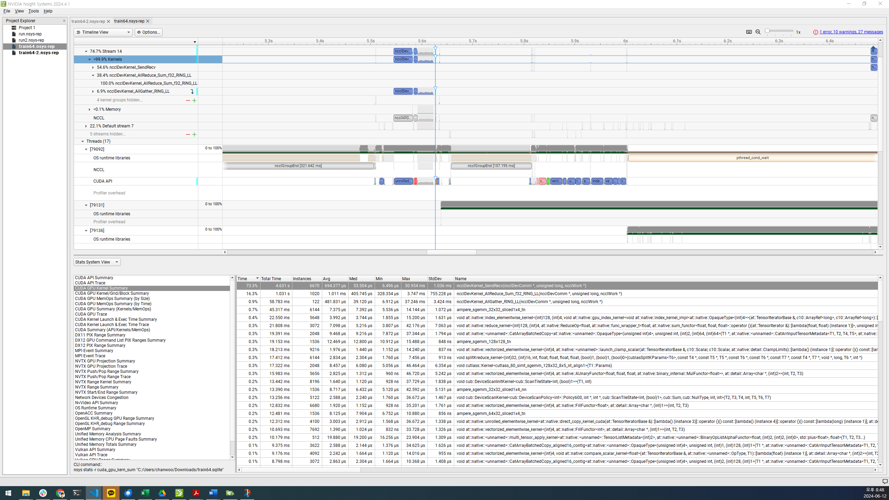


## Question 5
> Analyze using QRTrick, DHE and compare with using vanilla embedding table

System Configuration은 보고서 초에 기재한 것과 같다. 모델, 데이터, 훈련 설정은 아래와 같다.


|구분|내용|
|----|----|
|Model|DLRM|
|Dataset | Criteo Research Kaggle Display Advertising Challenge |
|Number of embedding tables| 26 |
|Embedding dimension | 16 |
|Size of each embedding table | 1000000 |
|Bottom MLP architecture | 16-64-16 |
|Top MLP architecture | 16-8-4-1 |


Embedding 별 모델 성능 차이는 다음과 같다.

|Embedding|Vanilla|QRE|DHE|
|---|---|---|---|
|Accuracy|76.792%|75.811%|74.658%|
|Number of parameters of embedding layers(*)|416M|**2.16M**|301M|
|Number of parameters of Top/Bottom MLPs|2.1k|2.1k|2.1k|
|Overhead of embedding lookup(GPU)|3.017ms|10.981ms|**13.569s**|
|Overhead of embedding lookup(CPU)|4.095ms|9.510ms|**4.639s**|

Embedding 별 Configuration은 아래와 같다.
|Embedding|Vanilla|QRE|DHE|
|---|---|---|---|
|QR Collision | N/A|200|N/A|
|$k,d_{h}$| N/A|N/A|1024,1800|


(*) Embedding Layer의 Model Size 산출 과정은 다음과 같다.
+ 공통상수
  + $T=26$: Embedding Table 수
  + $d=16$: Sparse feature의 Embedding Dimension
  + $N=1000000$: Sparse Feature의 수
+ Vanilla:$P = T \times d \times N = 416M$
+ QRE
  + $q=200$: QRE Embedding에서 Quotient
  + $P=(N / q + q) \times d \times N = 2.16M$
+ DHE
  + $k=1024$: DHE에서 사용할 Random Hash Function의 수
  + $d_h =1800$: DHE의 내부 Layer들의 Hidden Dimension
  + Architecture: $k-d_h-d_h-d_h-d_h-d$ (5 layers)
  + $P(in,out)=in\times out +out$
  + $P=P(k,d_h)+P(d_h,d_h)+P(d_h,d_h)+P(d_h,d_h)+P(d_h,d) = 301M$


훈련 세부 설정은 아래와 같다.

|제목|내용|
|----|----|
|Batchsize | 2048 |
|Learning rate | 1.0 |
|Number of train batches | 1000 |
|Learning rate warmup | 100 Steps |
|Learning rate decay | 900 Steps |

DHE에서 GPU Time이 다른 Embedding 기법에 비해 월등히 높게 측정되었다. 이 원인은 크게 두 가지로 나눌 수 있다.
- Transformation, Linear Layer 등 다양한 연산 수행이 필요하므로 연산 수행 시간이 증가한다.
- 각 연산을 수행하기 위한 Global Memory - CUDA Core 간 Data Transfer가 빈번하게 발생하였다.

### Profiling Results (GPU)

Vanilla Embedding
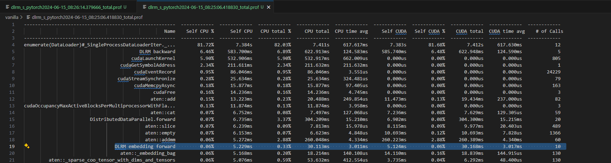

QRE Embedding
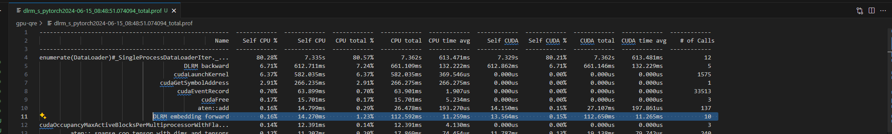

DHE Embedding
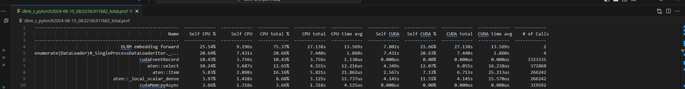

### Profiling Results (CPU)
Vanilla Embedding
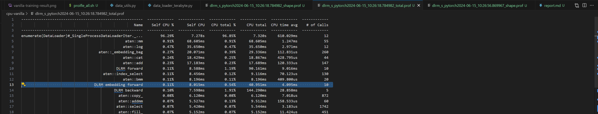

QRE Embedding
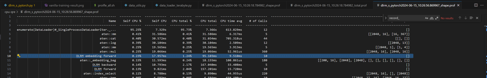

DHE Embedding
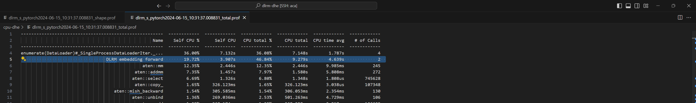

### 훈련 결과

Vanilla Embedding
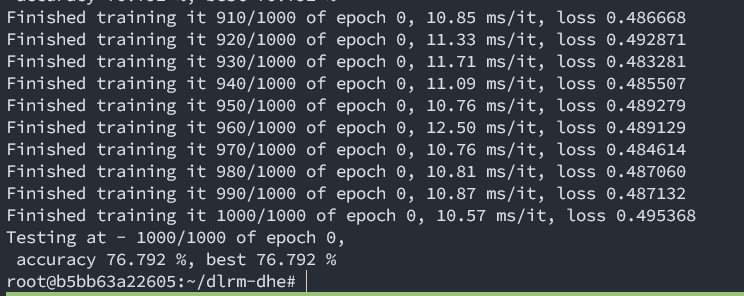

QRE Embedding
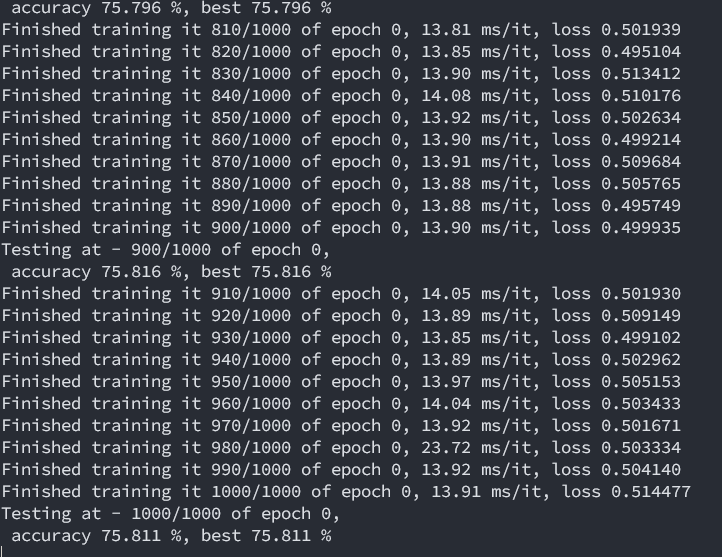

DHE Embedding
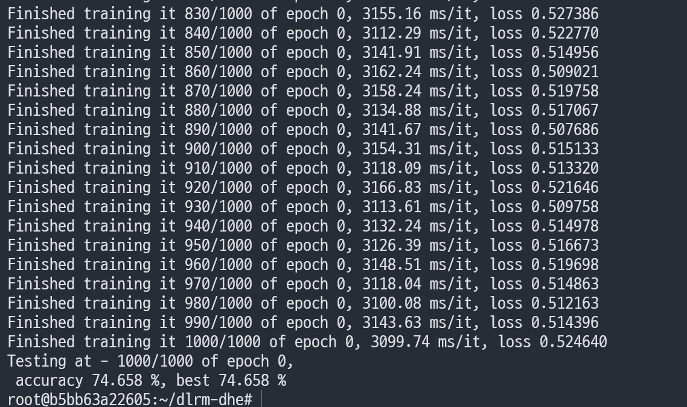